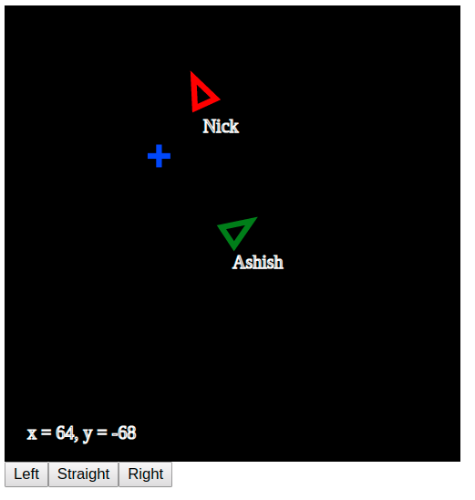
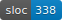

# The Problem



Making UIs is hard.

# The Solution

Use [concur-replica](https://github.com/pkamenarsky/concur-replica).

Want to have the user fill out two forms one after the other?
```hs
a <- form1
b <- form2
```

Want to show the user two inputs, and let them choose which to fill out?
```hs
res <- fmap Left form1 <|> fmap Right form2
case res of
  Left a ->
    -- ...

  Right b ->
    -- ...
```

It's so easy.

\* Caveat: this actually isn't the solution for all UIs. For one thing all the code runs on the server, so there will be more latency than might be acceptable for your application. For another `concur-replica` is a very early-stage project right now.

# In this repo

A toy `concur-replica` example that allows users to pilot ships around a shared map.



To run:
```sh
stack install
concur-replica-example-2d
# Open http://localhost:8080 to join
```

See [src/Cr2d/UI.hs](./src/Cr2d/UI.hs) for the meat of how it uses `concur-replica`.

The example is intended to be a good base for forking and making local or LAN based games (because of the latency issue). It isn't a game in itself since you can't do anything but move around.
